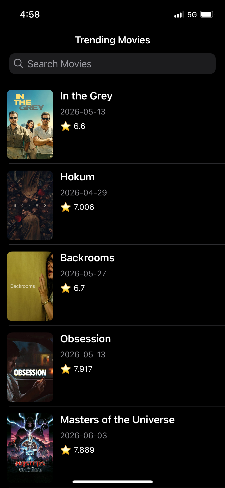
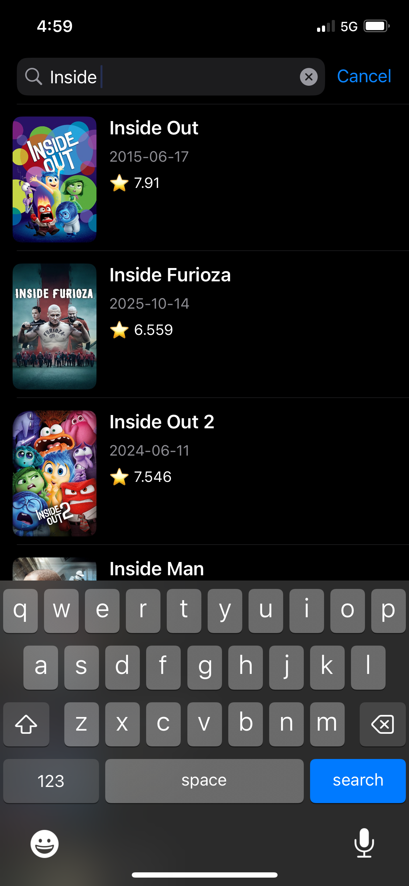
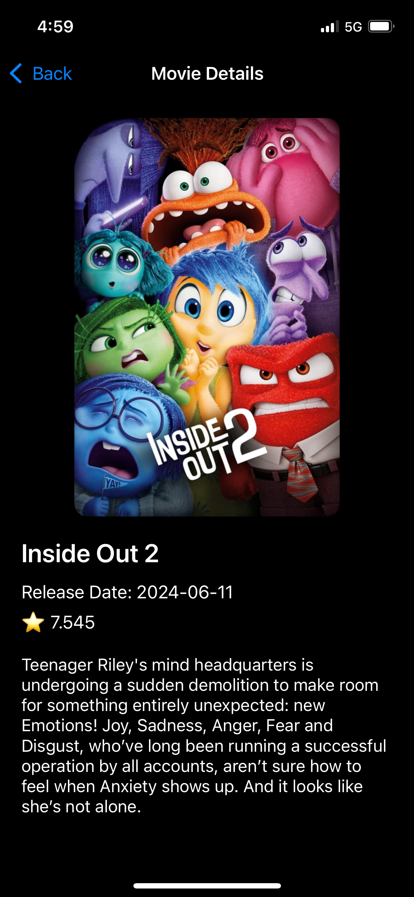

# TMDB Movie Browser (UIKit + MVVM)

A movie browsing application built using **UIKit**, **MVVM Architecture**, and **TMDB API**. This project was created as a learning journey to understand modern iOS development concepts such as networking, asynchronous programming, dependency injection, image caching, search, and pagination.

## Features

### Movie Listing

* Fetches trending movies from TMDB
* Displays movie posters, titles, release dates, and ratings
* Custom UITableViewCell implementation

### Movie Details

* Detailed movie screen
* Large movie poster
* Release date
* Rating
* Overview/description

### Search Movies

* Search movies using TMDB Search API
* Real-time search experience
* Debounced API requests to reduce network calls

### Infinite Scrolling

* Loads additional pages automatically when reaching the bottom of the list
* Supports pagination for both trending and search results

### Image Loading & Caching

* Asynchronous image loading using URLSession
* In-memory image caching using NSCache
* Prevents unnecessary image downloads
* Handles cell reuse correctly

### State Management

* Loading state
* Loaded state
* Empty state
* Error state

## Architecture

The application follows the **MVVM (Model-View-ViewModel)** pattern.

```text
ViewController
      ↓
ViewModel
      ↓
Service Layer
      ↓
TMDB API
```

### Project Structure

```text
TMDBMovieBrowser
│
├── Models
│   ├── Movie.swift
│   └── PaginatedMovies.swift
│
├── Services
│   ├── MovieServiceProtocol.swift
│   ├── TMDBService.swift
│   ├── Endpoint.swift
│   └── ImageLoader.swift
│
├── ViewModels
│   ├── MovieListViewModel.swift
│   └── ViewState.swift
│
├── Views
│   └── MovieTableViewCell.swift
│
├── Controllers
│   └── MovieDetailsViewController.swift
│
└── ViewController.swift
```

## Concepts Learned

### Networking

* URLSession
* URLRequest
* HTTP Headers
* REST APIs
* Async/Await

### Swift Language Features

* Protocols
* Extensions
* Closures
* Escaping Closures
* Generics
* Enums
* Dependency Injection
* Access Control
* Weak References
* Async Tasks

### UIKit

* UITableView
* UITableViewCell
* UINavigationController
* UISearchController
* Auto Layout
* Programmatic UI

### Performance Optimization

* NSCache
* Cell Reuse
* Pagination
* Debounced Search
* Background Image Loading

## API

This project uses The Movie Database (TMDB) API.

### Endpoints Used

#### Trending Movies

```http
GET /trending/movie/day
```

#### Search Movies

```http
GET /search/movie
```

#### Images

```http
https://image.tmdb.org/t/p/w500/{poster_path}
```

## Setup

### 1. Clone Repository

```bash
git clone https://github.com/your-username/TMDBMovieBrowser.git
```

### 2. Open Project

```bash
open TMDBMovieBrowser.xcodeproj
```

### 3. Get TMDB API Token

1. Create an account on TMDB
2. Generate a Read Access Token
3. Open `TMDBService.swift`
4. Replace:

```swift
private let bearerToken = "YOUR_TMDB_BEARER_TOKEN"
```

with your TMDB Read Access Token.

### 4. Run

Select an iOS Simulator and run the project.

## Screenshots

<table> <tr> <td align="center"> <strong>Home Screen</strong><br><br>  </td> <td align="center"> <strong>Search Results</strong><br> <br> </td> <td align="center"> <strong>Details Screen</strong><br><br>  </td> </tr> </table>

## Learning Outcomes

Through this project, I gained hands-on experience with:

* Building scalable UIKit applications
* MVVM architecture
* API integration
* Async/Await concurrency
* Dependency Injection
* Pagination
* Search optimization
* Image caching
* Programmatic Auto Layout
* Clean code organization

## License

This project is intended for educational and learning purposes.
